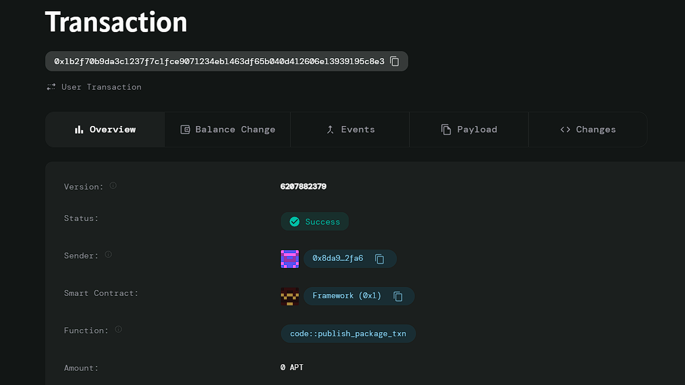

# Loyalty Points Program

# Deployed ID: 0x1b2f70b9da3c1237f7c1fce9071234eb1463df65b040d412606e13939195c8e3

## Project Description
The Loyalty Points Program is a blockchain-based reward system designed to allow businesses to issue loyalty points as tokens to customers for their purchases. This system enables customers to redeem these tokens for discounts or special offers, ensuring transparent tracking of points.

## Project Vision
Our vision is to enhance customer engagement and retention through a decentralized loyalty points system. By leveraging blockchain technology, we aim to provide a secure and transparent way for customers to earn and redeem loyalty points, fostering loyalty across partnered businesses.

## Key Features
- **Issuance of Loyalty Points**: Businesses can issue points to customers based on their purchases.
- **Redemption Mechanism**: Customers can redeem loyalty points for discounts or special offers.
- **Transparent Tracking**: The system provides a transparent way to track points earned and redeemed.
- **Cross-Business Compatibility**: Points can be used across partnered businesses, enhancing customer options.
